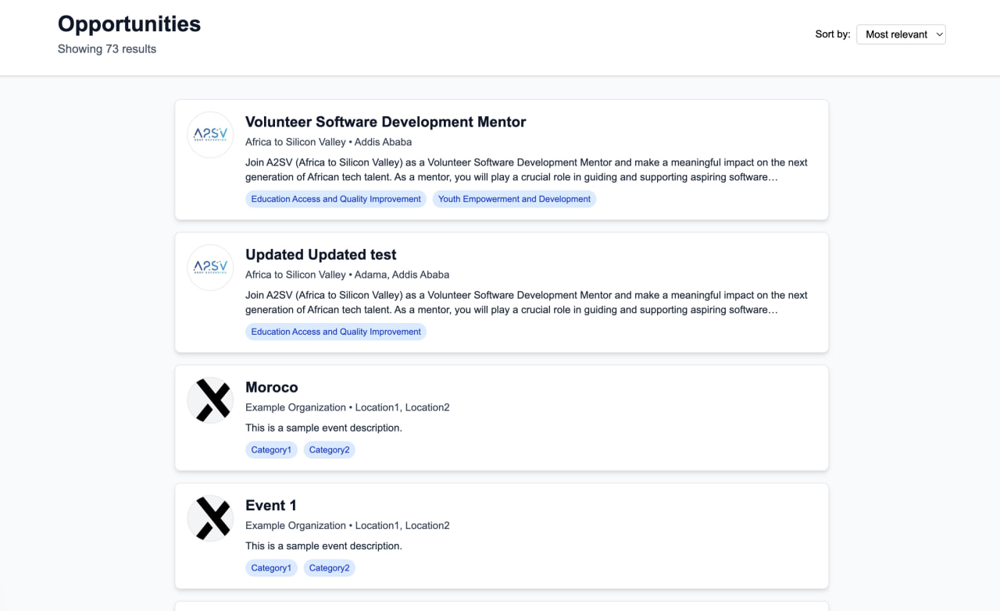
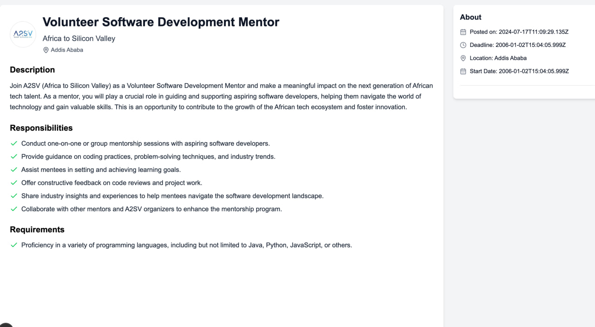
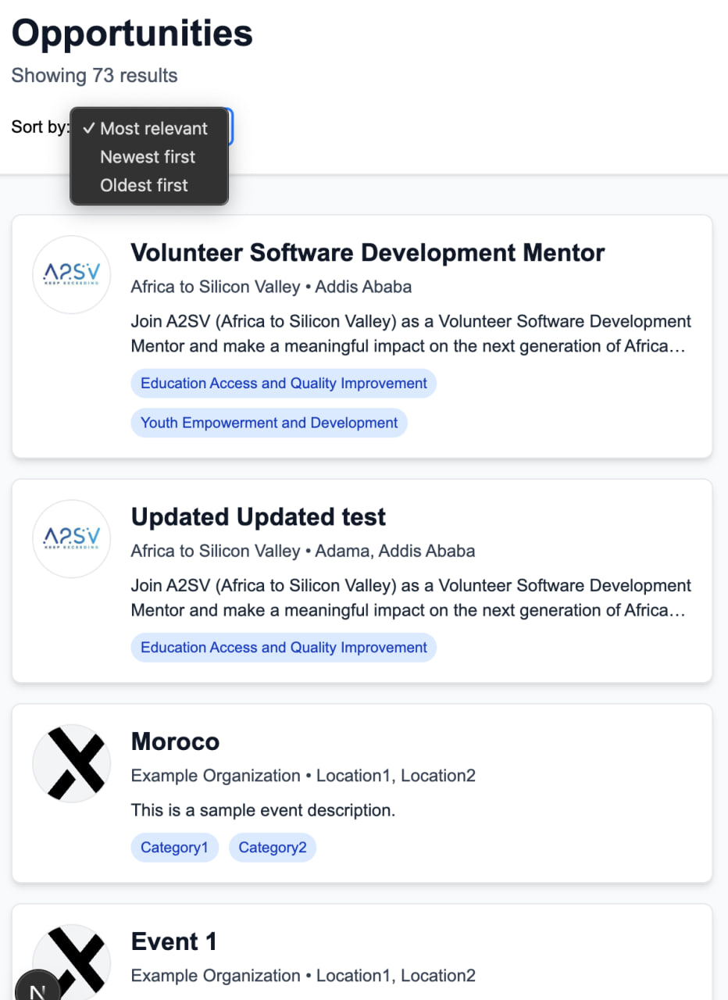

# Job Opportunities Web App

A modern job listing platform built with Next.js, Redux Toolkit Query, and Tailwind CSS. This app fetches job opportunities from a backend API and displays them in a clean, responsive UI.

---

## 🚀 Features

- **Landing Page:**
  - Lists all job opportunities in a single vertical column.
  - Each card shows job title, company, location, description, and categories.
  - “Sort by” dropdown (UI only, not functional).

- **Job Details Page:**
  - Click a card to view full job details.
  - See description, responsibilities, requirements, and sidebar with meta info (dates, location, categories, skills).

- **API Integration:**
  - All job data is fetched from a real backend API using RTK Query.

- **Error Handling:**
  - Graceful loading spinners and error messages if the API fails.

- **Modern UI:**
  - Responsive, clean, and visually appealing.
  


---

## 🛠️ Tech Stack

- **Next.js** (App Router, React 18)
- **Redux Toolkit & RTK Query**
- **Tailwind CSS**
- **Lucide React** (icons)
- **TypeScript**

---

## ⚙️ Setup & Running Locally

1. **Install dependencies:**
   ```bash
   npm install
   ```
2. **Run the development server:**
   ```bash
   npm run dev
   ```
3. **Open [http://localhost:3000](http://localhost:3000) in your browser.**

---

## 📸 Screenshots


### Landing Page


### Job Details Page


### Responsive pages



---

## 📖 API Reference

- **Base URL:** `https://akil-backend.onrender.com/`
- **Endpoints:**
  - `GET /opportunities/search` — Get all opportunities
  - `GET /opportunities/:id` — Get opportunity by ID
