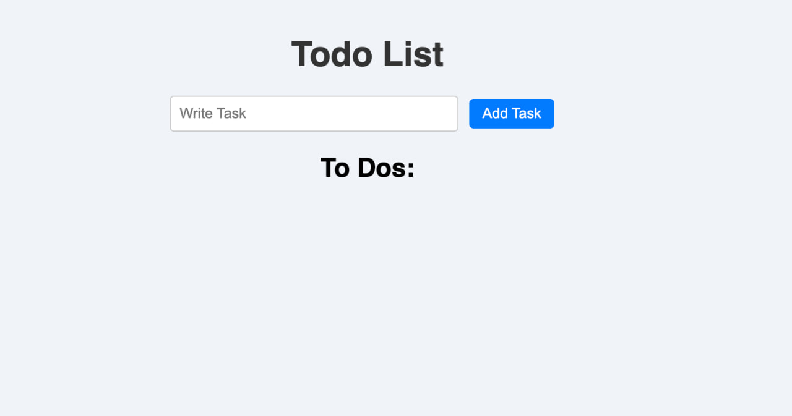
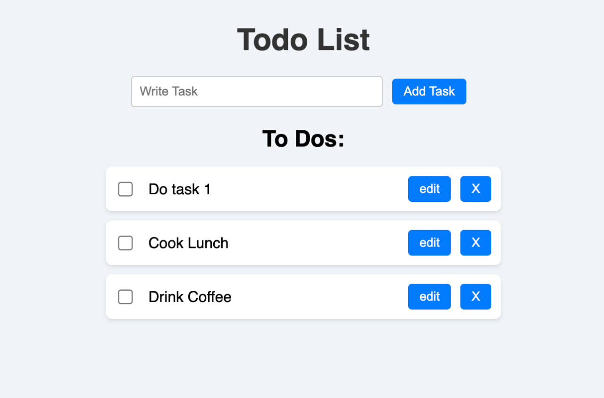
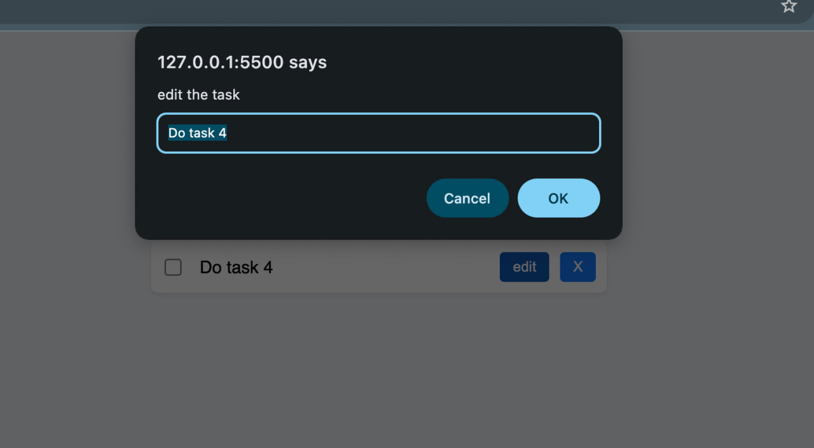
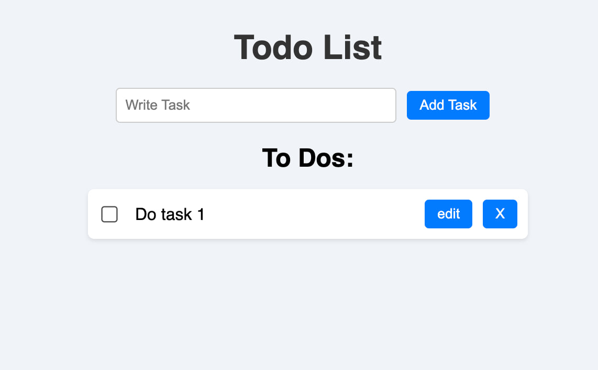
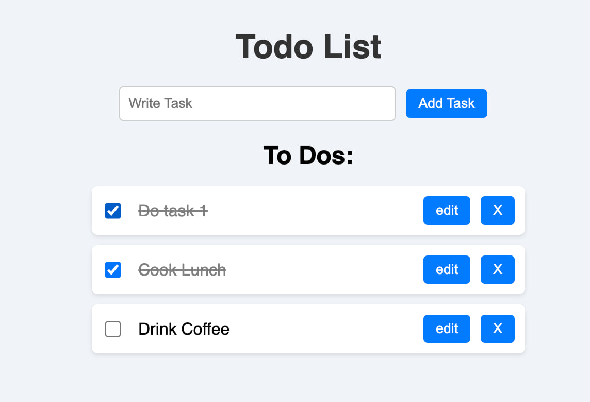

# ✅ Todo List Application

This is a simple web-based Todo List built using HTML, CSS, and JavaScript.  
Users can:
- Add new tasks
- Edit specific tasks
- Delete any task
- Check off completed tasks
- Save all tasks using localStorage so they don't disappear on reload

---

## ▶️ How to Run This Project

1. Clone the repo:
   ```
   git clone https://github.com/your-username/todo-list.git
   ```

2. Open the folder:
   ```
   cd todo-list
   ```

3. Then open `index.html` in your browser (you can double-click it or use VS Code Live Server).

---

## 📸 Screenshots

### 🏠 Main Page

  
This is the main interface of the app where you can add tasks.

### ➕ Add Task

  
Shows a new task being added to the list.

### ✏️ Edit Task

  
Shows how you can edit a specific task by clicking the `edit` button.

### ❌ Delete Task

  
Shows how a task can be deleted by clicking the `X` button.

### ✅ Check Off Task

  
Tasks can be marked as done using the checkbox (strikethrough effect).

---


## 🔗 GitHub Repository

👉 [View the repo here](https://github.com/your-username/todo-list)
